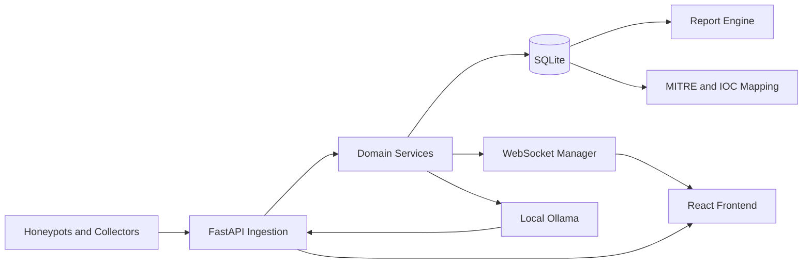

# 02 — System Architecture

## Logical architecture



## Runtime processes

1. Ollama service
2. FastAPI backend
3. React development server or production static frontend
4. Optional local collectors
5. Optional honeypot listeners

## Domain boundaries

- **Attacks:** normalized security events
- **Sensors:** honeypot and collector state
- **Monitoring:** host metrics
- **AI:** model discovery, chat and analysis
- **Reports:** jobs, artifacts and exports
- **MITRE:** tactics, techniques and mappings
- **Windows logs:** event ingestion and analysis
- **Settings:** validated configuration
- **Audit:** user and system actions

## Event flow

```text
Sensor event
  -> validation
  -> normalization
  -> classification
  -> database
  -> WebSocket broadcast
  -> UI update
  -> optional AI analysis
  -> optional MITRE mapping
  -> optional report inclusion
```

## Reliability principles

- All external calls have timeouts.
- WebSockets reconnect with backoff.
- Collectors send heartbeats.
- Report generation uses jobs.
- Startup is idempotent.
- Shutdown closes connections and tasks.
- Errors use stable response formats.
