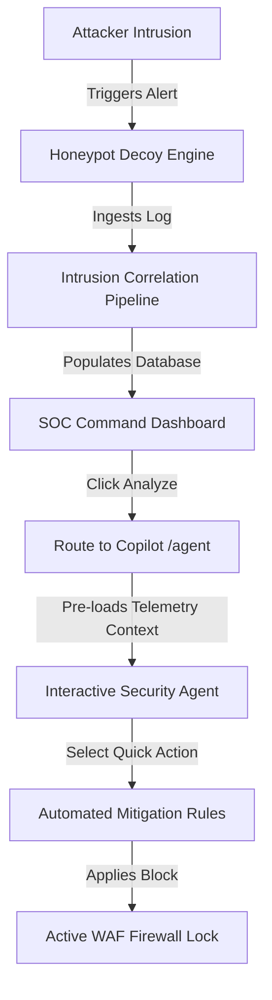

# SentinelAI — AI-Powered Cyber Defense Platform

SentinelAI is a professional, local-first, AI-powered cyber-defense platform and Security Operations Center (SOC) simulation system. It integrates host monitoring, intrusion sensors, dynamic honeypot decoy engines, and automated MITRE ATT&CK mapping with high-performance cognitive intelligence models (via Groq Cloud API & Ollama) to build a robust security copilot experience.

---

## 📌 Table of Contents

* [🚀 Key Features](#-key-features)
* [🛠️ Tech Stack](#️-tech-stack)
* [🖼️ Screenshots](#️-screenshots)
* [⚡ Quick Setup](#-quick-setup)
* [📂 Project Structure](#-project-structure)
* [🔄 Usage Workflow](#-usage-workflow)
* [📅 Roadmap & Completed Phases](#-roadmap--completed-phases)
* [🛡️ Security & Legal Disclaimer](#️-security--legal-disclaimer)
* [📄 License](#-license)
* [📚 Additional Documentation](#-additional-documentation)

---

## 🚀 Key Features

* **Real-time Threat Monitoring**: Captures live syslog stream telemetry, TCP ports scan activities, and honeypot traps triggers.
* **AI Security Copilot**: Stream-based SOC agent powered by Groq Cloud models (`llama-3.3-70b-versatile`) offering context-aware chat, incident analysis, packet dissection, and mitigation rules.
* **Incident-Aware Routing**: Attaches localized attack details (GeoIP, payload buffers, signatures, destination ports) automatically to assistant workflows.
* **MITRE ATT&CK Mapping**: Parses and maps indicators of compromise (IOCs) dynamically to ATT&CK tactics, techniques, and procedures (TTPs).
* **Decoy Sandbox Analyst**: Inspects simulated malicious payloads inside safe behavioral containment structures.
* **Playbook Engine**: Orchestrates active defense countermeasures (e.g. firewall routing locks, sensor reconfigurations, network isolation).
* **Vitals & Telemetry Dashboard**: Fixed-shell view displaying CPU logs, memory bandwidth, threat score counters, and map visualizers without horizontal scrolls.

---

## 🛠️ Tech Stack

### Backend
* **Runtime**: Python 3.14.x
* **Framework**: FastAPI (Uvicorn ASGI server)
* **ORM & Database**: SQLAlchemy with SQLite
* **Realtime communication**: WebSockets
* **AI Inference**: Groq Cloud SDK / local Ollama bindings
* **Tests**: Pytest suite

### Frontend
* **Runtime**: Node.js
* **Framework**: React.js with Vite
* **Routing & UI**: React Router Dom, Lucide icons, Framer Motion
* **Analytics**: Recharts (for live timeline alerts, sensor status, and threat indices)

---

## 🖼️ Screenshots

*Placeholders for user interface visuals:*
* *[SOC Command Center Dashboard] - Live graphs, system vitals, and geographical threat map.*
* *[Copilot Assistant Workspace] - Contextual AI streaming, MITRE maps, and quick scans drawer.*
* *[Active Decoy Sandbox] - Behavior analyzer outputs and Honeypot logs feed.*

---

## ⚡ Quick Setup

### Prerequisites
* Python 3.14+ installed
* Node.js v18+ installed

### 1. Backend Service Setup
1. Open a terminal in the `/backend` directory.
2. Initialize virtual environment:
   ```bash
   python -m venv .venv
   .venv\Scripts\activate
   ```
3. Install required packages:
   ```bash
   pip install -r requirements.txt
   ```
4. Copy environment configuration:
   ```bash
   cp .env.example .env
   ```
5. *Note on Environment variables*: Configure your `GROQ_API_KEY` securely inside `backend/.env`. Do **not** commit this file.
6. Launch backend server:
   ```bash
   $env:PYTHONPATH=".."  # on PowerShell
   # OR export PYTHONPATH=".." on Bash
   .venv\Scripts\uvicorn main:app --reload --port 8000
   ```

### 2. Frontend Application Setup
1. Open a terminal in the `/frontend` directory.
2. Install npm dependencies:
   ```bash
   npm install
   ```
3. Start Vite dev server:
   ```bash
   npm run dev
   ```
4. Access the web dashboard at `http://localhost:5173`.

---

## 📂 Project Structure

```text
SentinelAI/
├── backend/                  # FastAPI Application
│   ├── api/                  # API Routers (agent, attacks, sandbox, reports, playbooks)
│   ├── core/                 # App configurations (config.py, logging, security)
│   ├── database/             # SQLite connection wrapper
│   ├── models/               # SQLAlchemy models (base, model definitions)
│   ├── schemas/              # Pydantic validation schemas
│   ├── services/             # Correlation engine, WAF defense, honeypots, AI adapters
│   └── tests/                # Automated pytest integration cases
├── frontend/                 # React Application
│   ├── src/
│   │   ├── components/       # Custom panels, state controllers, maps
│   │   ├── layouts/          # DashboardLayout container
│   │   └── pages/            # View pages (dashboard, agent, playbooks, sandbox)
├── docs/                     # Technical and system architectural documentation
└── scripts/                  # Command utilities and launcher bat scripts
```

---

## 🔄 Usage Workflow



1. **Intrusion Captured**: A suspicious network probe hits the decoy honeypot.
2. **Analysis Triggered**: The incident appears in the Live Attack Feed. Clicking **Analyze** navigates to the Copilot workbench.
3. **Context Loading**: The threat parameters (IP, service port, threat payload) are mounted to the right-side context card and sent as system instructions.
4. **Quick Mitigation**: Clicking **Recommend Firewall Rule** generates specific block configurations (iptables, Cisco lists, or WAF rules) to protect target nodes.

---

## 📅 Roadmap & Completed Phases

### Completed
* **Phase 1-13**: System core, log pipeline, database tables, and decoy sandbox.
* **Phase 14**: Ollama to Groq migration. Secure key integration inside `backend/.env`, streaming chunk formatting, and viewport style locks.
* **Phase 15A**: AI Security Copilot upgrade. Context-aware prompt injection (`[ATTACK EVENT CONTEXT]`), high-fidelity markdown parser, and dynamic Quick Scan actions.

### In Progress / Future Plan
* **Phase 15B**: Auto-generation of automated SIEM queries (KQL, Splunk SPL).
* **Phase 16**: Enterprise Active Defense actions deployment.
* **Phase 17**: Multi-sensor agent cluster aggregation support.
* **Phase 18**: LDAP/Active Directory SSO authentication layer.

---

## 🛡️ Security & Legal Disclaimer

This repository is designed strictly for research, testing, and educational simulation purposes. Active honeypot features should only be run inside isolated testbeds. The authors are not responsible for any damage, service disruptions, or compliance failures caused by improper production deployment or exposure of Groq keys.

---

## 📄 License
Distributed under the MIT License. See `LICENSE` for more information (Placeholder).

---

## 📚 Additional Documentation

For detailed analysis, implementation details, and structural design logs, refer to the following project documents:
* [Project Vision & Overview](file:///d:/Documents/SentinelAI/docs/PROJECT_OVERVIEW.md) — Mission guidelines and core modules.
* [System Architecture & DB Models](file:///d:/Documents/SentinelAI/docs/ARCHITECTURE.md) — Topology charts and schema models lists.
* [Installation & Setup Guide](file:///d:/Documents/SentinelAI/docs/SETUP.md) — Prerequisites and startup terminal commands.
* [Operations Workflow](file:///d:/Documents/SentinelAI/docs/WORKFLOW.md) — Step-by-step alert correlation lifecycle.
* [Feature Reference](file:///d:/Documents/SentinelAI/docs/FEATURES.md) — Copilot specifications and decoy honeypots.
* [API Reference](file:///d:/Documents/SentinelAI/docs/API_REFERENCE.md) — FastAPI endpoint JSON schemas and parameters.
* [Development Roadmap](file:///d:/Documents/SentinelAI/docs/ROADMAP.md) — Progress mapping and future phases.
* [Security Notes & Policies](file:///d:/Documents/SentinelAI/docs/SECURITY_NOTES.md) — Key rotations and sandbox warnings.