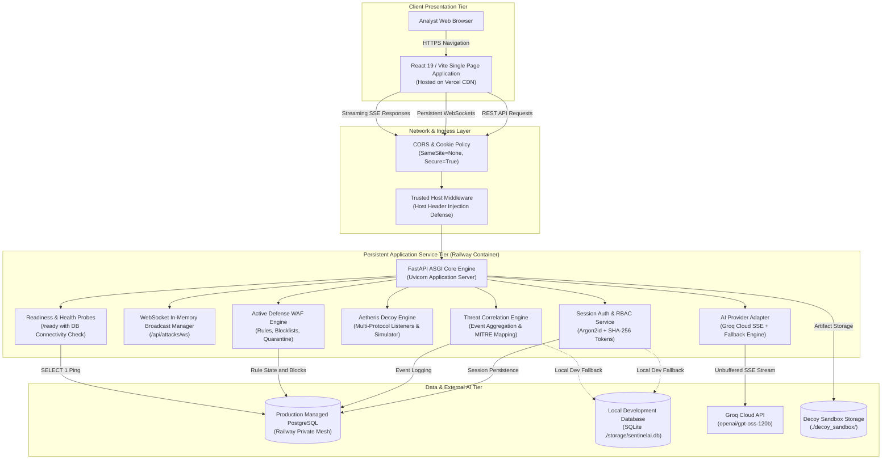
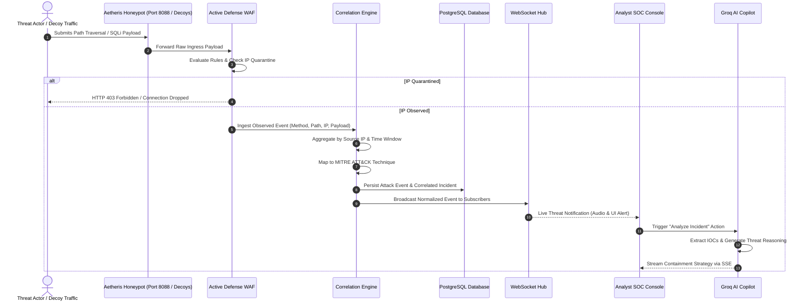
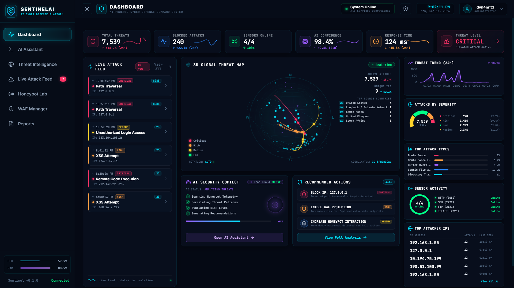
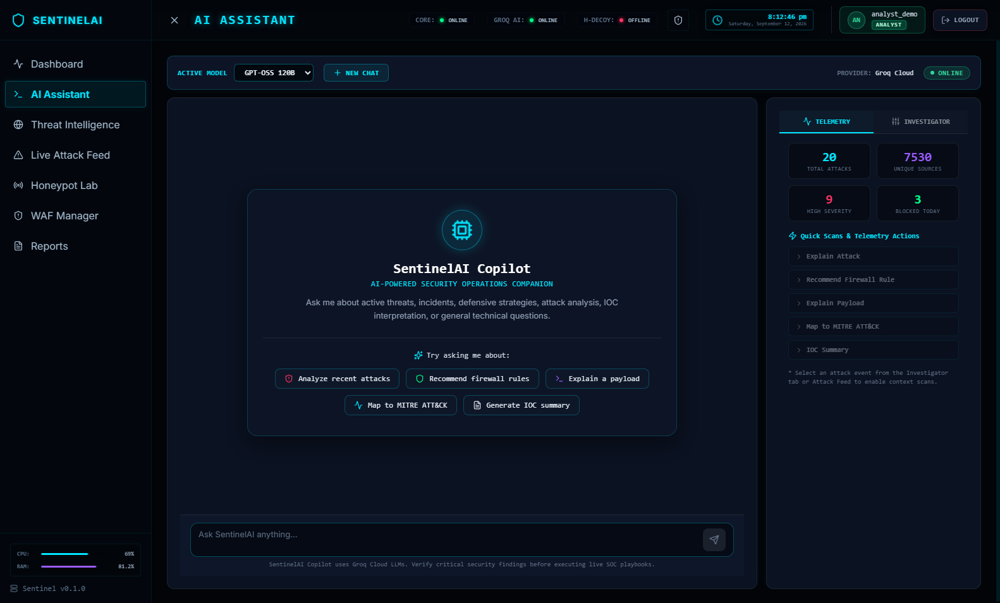
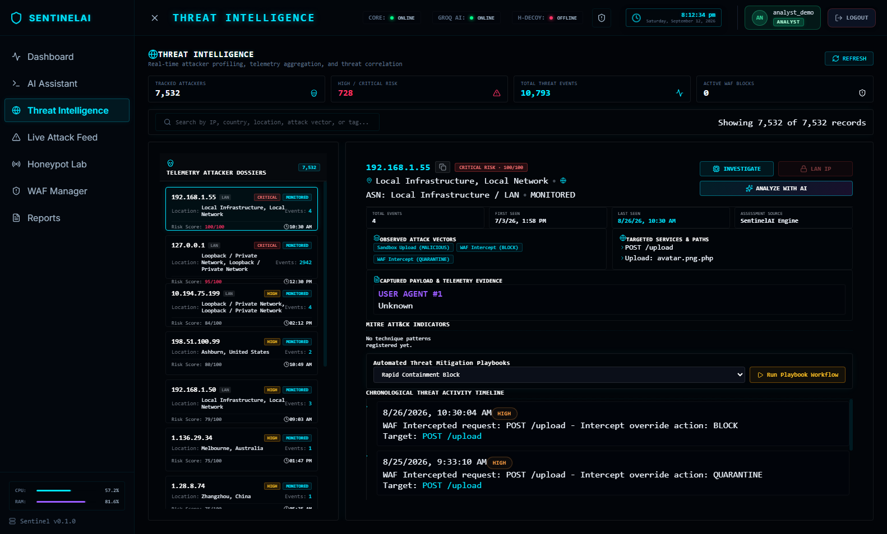
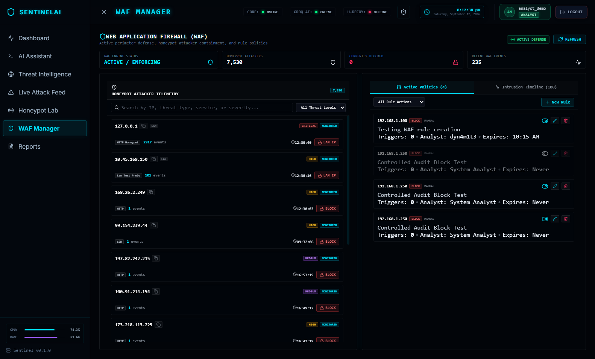
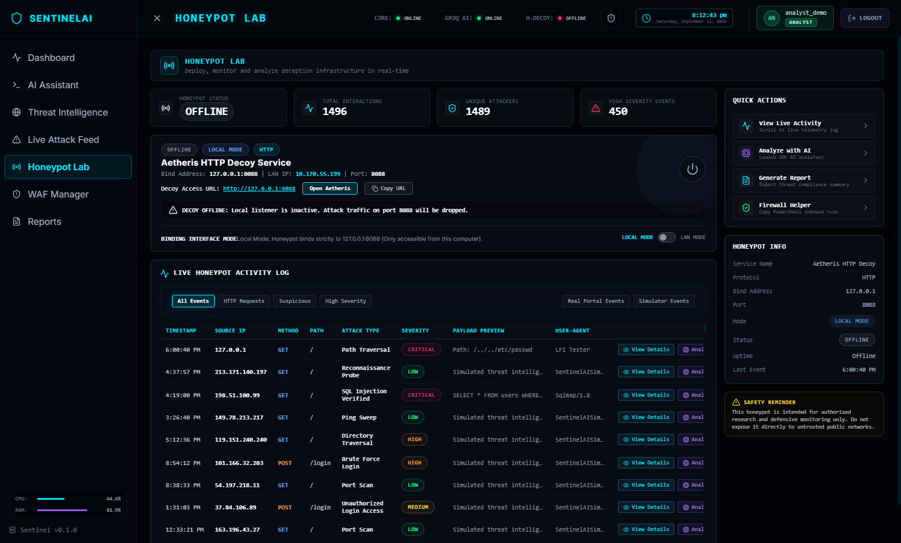
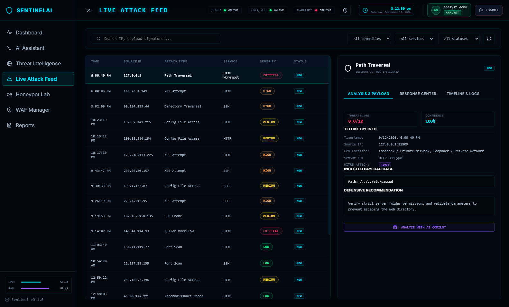
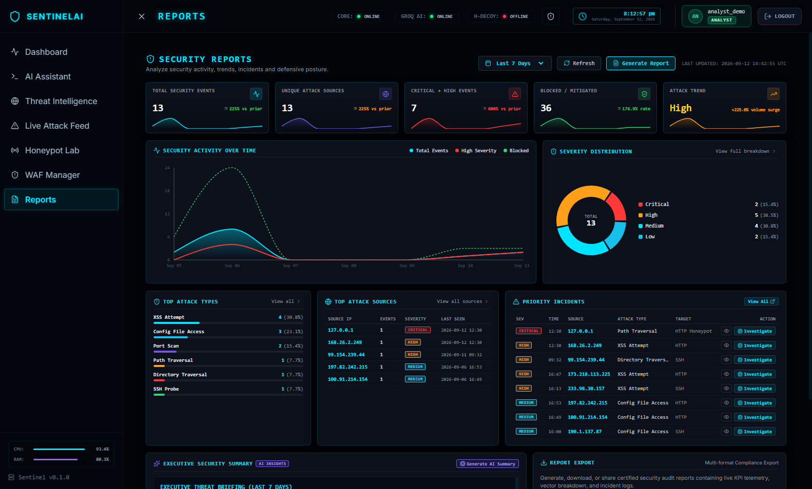
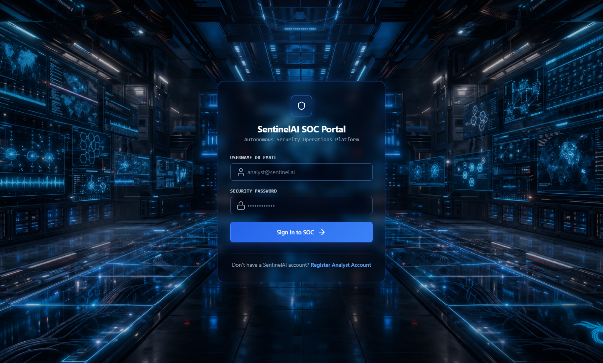

# SentinelAI — Autonomous Cyber Defense & SOC Platform

<p align="center">
  
</p>

<p align="center">
  <a href="https://github.com/Vaishnav53/SentinelAI/actions"></a>
  
  
  
  
  
  
  
  <a href="LICENSE"></a>
</p>

---

## 📌 Executive Overview

**SentinelAI** is an autonomous, full-stack Security Operations Center (SOC) simulation, threat intelligence correlation, and incident response platform. Designed for modern cyber defense environments, it bridges the gap between high-velocity security telemetry ingestion and tactical analyst decision-making.

The platform integrates:
1. **Live Host & Perimeter Telemetry Ingestion**: Continuous host vital tracking (`psutil`), dynamic Threat Level indexing, and sub-second WebSocket event streaming.
2. **Active Web Application Firewall (WAF)**: Signature inspection for SQL Injection (SQLi), Cross-Site Scripting (XSS), and Path Traversal, coupled with dynamic IP quarantine and observed threat actor tracking.
3. **Aetheris Decoy Honeypot Infrastructure**: Multi-protocol deception sensors emulating vulnerable HTTP services (Port `8088`), SSH listeners (Port `2222`), FTP decoys (Port `2121`), and Telnet ports (Port `2323`) with toggleable local-loopback and LAN broadcast modes.
4. **Threat Correlation & MITRE ATT&CK Engine**: Rule-based aggregation grouping raw micro-events into high-confidence **Correlated Incidents** mapped to MITRE tactics and techniques.
5. **AI Security Copilot & Investigator Workspace**: An interactive reasoning layer powered by **Groq Cloud** (`openai/gpt-oss-120b`) with a deterministic local fallback engine, delivering unbuffered Server-Sent Events (SSE) streaming and 7 structured investigation actions.

---

## 🎯 Why SentinelAI? (Problem & Motivation)

Modern enterprise SOCs face severe operational hurdles:
* **Alert Fatigue**: Security analysts are overwhelmed by thousands of disconnected security logs per day, leading to missed critical indicators of compromise (IOCs).
* **Delayed Threat Correlation**: Attackers rarely use a single vector; brute-force attacks on SSH or admin portals often precede lateral movement or SQL injection exploitation. Correlating these disparate events manually takes hours.
* **Passive vs. Active Defense**: Traditional firewalls simply drop packets without analyzing attacker behavior or gathering intelligence on techniques, payloads, and command structures.
* **Investigation Latency**: Triaging incidents, extracting IOCs, mapping attacks to MITRE ATT&CK, and drafting containment recommendations requires manual lookups across disparate tools.

**SentinelAI solves these challenges** by integrating deceptive honeypot telemetry directly with perimeter WAF defenses, aggregating threat micro-events into unified incident dossiers, and deploying a specialized AI Copilot to deliver instant contextual triage, timeline synthesis, and containment guidance.

---

## 🚀 Key Implemented Capabilities

### 1. Real-Time SOC Command Center (`/dashboard`)
* **Live System Vitals**: Real-time host CPU, RAM, disk utilization, and uptime telemetry via `psutil`.
* **Dynamic Threat Indexing**: Composite real-time calculation of overall Threat Level (`CRITICAL`, `HIGH`, `MEDIUM`, `LOW`) and AI Confidence scores.
* **3D Global Threat Globe**: Interactive Three.js holographic projection visualizing geographical source-to-target threat vectors.
* **Bi-Directional WebSocket Feeds**: Low-latency event streaming via `/api/attacks/ws` with automatic client reconnection.

### 2. Live Threat Attack Feed & Triage (`/attacks`)
* **Unified Telemetry Ingress**: Normalized ingestion pipeline for decoy events, firewall interceptions, and honeypot hits.
* **Multi-Criteria Filtering**: Filter by severity level, targeted protocol (`HTTP`, `SSH`, `FTP`, `TELNET`), status (`NEW`, `INVESTIGATING`, `RESOLVED`), and analyst assignment.
* **Payload Deep Dive**: Inspect ingested HTTP query strings, request bodies, traversal attempts, and SSH authentication attempts.

### 3. Threat Intelligence & Attacker Profiling (`/attackers`)
* **Attacker Dossiers**: Aggregated threat actor profiles categorized by IP address, ASN, geographic origin, and attack frequency.
* **Risk Scoring Algorithm**: Dynamic risk score calculation (0–100) based on attack frequency, payload severity, and multi-vector targeting.
* **MITRE ATT&CK Mapping**: Direct linkage to enterprise techniques (e.g., `T1110` Brute Force, `T1059` Command Injection, `T1083` File Discovery).

### 4. Active Defense Web Application Firewall (`/waf`)
* **Inspection Engine**: Evaluates incoming request parameters, headers, and paths against heuristic detection rules.
* **Automated & Manual Quarantine**: Enforces temporary and permanent IP blocklists with configurable expiration times.
* **Observed Sources Tracking**: Maintains counters for unique attackers, blocked requests, and rule trigger counts.

### 5. Aetheris Decoy Honeypot Lab (`/sensors`)
* **Multi-Protocol Emulation**: Decoy services emulating vulnerable targets:
  * HTTP Web Service & Decoy Admin Portal (`8088`)
  * SSH Authentication Listener (`2222`)
  * FTP File Transfer Decoy (`2121`)
  * Telnet Terminal Decoy (`2323`)
* **Binding Interface Toggle**: Switch seamlessly between **Local Loopback (`127.0.0.1`)** for safe local experimentation and **LAN Broadcast (`0.0.0.0`)** for network-wide telemetry capture.
* **Firewall Rule Generator**: Generates copy-pasteable PowerShell inbound firewall commands for safe port management.

### 6. AI Security Copilot & 7-Action Investigator (`/agent`)
* **Dual-Mode Workspace**:
  * **Telemetry Copilot Tab**: Natural language interface for querying platform telemetry, explaining threat concepts, and recommending defensive postures.
  * **Investigator Tab**: Deep contextual incident triaging featuring **7 Structured AI Investigation Actions**:
    1. *Analyze Incident*
    2. *Explain Severity*
    3. *Extract IOCs*
    4. *Recommend Containment*
    5. *Map to MITRE ATT&CK*
    6. *Generate Attack Timeline*
    7. *Draft Executive Summary*
* **Provider Architecture**: Primary streaming reasoning powered by **Groq Cloud** (`openai/gpt-oss-120b`). If the API key is unconfigured or rate-limited, SentinelAI automatically activates its deterministic local fallback engine.

### 7. Decoy Malware Sandbox (`/sandbox`)
* **Artifact Ingestion**: Upload suspicious artifacts into an isolated staging directory (`./decoy_sandbox/`).
* **Cryptographic Hashing**: Computes MD5, SHA-1, and SHA-256 hashes on ingestion.
* **Static Heuristic Scoring**: Evaluates file headers, suspicious strings, and binary entropy to derive a composite threat score.

### 8. Automated Remediation Playbooks (`/playbooks`)
* **Pre-Configured Workflows**: Rapid-response playbooks including *Brute Force IP Containment* and *SQL Injection Quarantine*.
* **Execution Auditing**: Real-time logging of playbook execution steps, impacted assets, and mitigation outcomes.

### 9. Executive Reports & Export (`/reports`)
* **Compliance Documentation**: Generates structured executive PDF summary reports detailing incident timelines and mitigation steps.
* **CSV Telemetry Export**: Download raw event logs for external SIEM integration or archival.

---

## 📐 System Architecture

### Multi-Tier Platform Topology


```mermaid
graph TB
    subgraph Client ["Client Presentation Tier"]
        Browser["Analyst Web Browser"]
        Vite_React["React 19 / Vite Single Page Application<br/>(Hosted on Vercel CDN)"]
        Browser -->|HTTPS Navigation| Vite_React
    end

    subgraph Edge ["Network & Ingress Layer"]
        CORS["CORS & Cookie Policy<br/>(SameSite=None, Secure=True)"]
        TrustedHost["Trusted Host Middleware<br/>(Host Header Injection Defense)"]
    end

    subgraph Backend ["Persistent Application Service Tier (Railway Container)"]
        FastAPI["FastAPI ASGI Core Engine<br/>(Uvicorn Application Server)"]
        Auth_RBAC["Session Auth & RBAC Service<br/>(Argon2id + SHA-256 Tokens)"]
        WS_Manager["WebSocket In-Memory Broadcast Manager<br/>(/api/attacks/ws)"]
        WAF_Service["Active Defense WAF Engine<br/>(Rules, Blocklists, Quarantine)"]
        Honeypot_Service["Aetheris Decoy Engine<br/>(Multi-Protocol Listeners & Simulator)"]
        Correlation_Engine["Threat Correlation Engine<br/>(Event Aggregation & MITRE Mapping)"]
        AI_Orchestrator["AI Provider Adapter<br/>(Groq Cloud SSE + Fallback Engine)"]
        Readiness["Readiness & Health Probes<br/>(/ready with DB Connectivity Check)"]
    end

    subgraph Persistence ["Data & External AI Tier"]
        PG_DB[("Production Managed PostgreSQL<br/>(Railway Private Mesh)")]
        SQLite_DB[("Local Development Database<br/>(SQLite ./storage/sentinelai.db)")]
        Groq_API["Groq Cloud API<br/>(openai/gpt-oss-120b)"]
        Sandbox_FS[("Decoy Sandbox Storage<br/>(./decoy_sandbox/)")]
    end

    Vite_React -->|REST API Requests| CORS
    Vite_React -->|Persistent WebSockets| CORS
    Vite_React -->|Streaming SSE Responses| CORS
    CORS --> TrustedHost
    TrustedHost --> FastAPI

    FastAPI --> Auth_RBAC
    FastAPI --> WS_Manager
    FastAPI --> WAF_Service
    FastAPI --> Honeypot_Service
    FastAPI --> Correlation_Engine
    FastAPI --> AI_Orchestrator
    FastAPI --> Readiness

    Auth_RBAC -->|Session Persistence| PG_DB
    Correlation_Engine -->|Event Logging| PG_DB
    WAF_Service -->|Rule State and Blocks| PG_DB
    Readiness -->|SELECT 1 Ping| PG_DB

    Auth_RBAC -.->|Local Dev Fallback| SQLite_DB
    Correlation_Engine -.->|Local Dev Fallback| SQLite_DB

    AI_Orchestrator -->|Unbuffered SSE Stream| Groq_API
    FastAPI -->|Artifact Storage| Sandbox_FS
```

### Telemetry Ingestion & Correlation Flow


```mermaid
sequenceDiagram
    autonumber
    actor Attacker as Threat Actor / Decoy Traffic
    participant Sensor as Aetheris Honeypot (Port 8088 / Decoys)
    participant WAF as Active Defense WAF
    participant Engine as Correlation Engine
    participant DB as PostgreSQL Database
    participant WS as WebSocket Hub
    participant Analyst as Analyst SOC Console
    participant AI as Groq AI Copilot

    Attacker->>Sensor: Submits Path Traversal / SQLi Payload
    Sensor->>WAF: Forward Raw Ingress Payload
    WAF->>WAF: Evaluate Rules & Check IP Quarantine
    alt IP Quarantined
        WAF-->>Attacker: HTTP 403 Forbidden / Connection Dropped
    else IP Observed
        WAF->>Engine: Ingest Observed Event (Method, Path, IP, Payload)
        Engine->>Engine: Aggregate by Source IP & Time Window
        Engine->>Engine: Map to MITRE ATT&CK Technique
        Engine->>DB: Persist Attack Event & Correlated Incident
        Engine->>WS: Broadcast Normalized Event to Subscribers
        WS-->>Analyst: Live Threat Notification (Audio & UI Alert)
        Analyst->>AI: Trigger "Analyze Incident" Action
        AI->>AI: Extract IOCs & Generate Threat Reasoning
        AI-->>Analyst: Stream Containment Strategy via SSE
    end
```

---

## 🔒 Security Architecture & Design Decisions

* **Secure Authentication & RBAC**:
  * **Password Storage**: Uses `argon2id` (the password-hashing competition winner) with dedicated cryptographic salts.
  * **Session Management**: Session tokens are cryptographically generated with 32 bytes of randomness, hashed using SHA-256 on the server side, and delivered exclusively via `HttpOnly`, `SameSite=None` (production cross-origin), and `Secure` cookies.
  * **Role-Based Access Control**: Strict segregation between `admin` and `analyst` roles enforced through FastAPI dependency injection (`get_current_user`, `require_role`).
* **Host Header Injection Protection**:
  * Integrated Starlette `TrustedHostMiddleware` enforcing explicit host allowlists (`TRUSTED_HOSTS`).
  * Explicitly accommodates internal cloud orchestrator probes (`healthcheck.railway.app`) to eliminate false-positive blocking during deployment readiness evaluations.
* **Cross-Origin Security (CORS)**:
  * Strict credentialed CORS origin allowlisting (`get_cors_origins()`), preventing arbitrary third-party web origins from issuing unauthorized authenticated requests.
* **Dual-Dialect Database Resiliency**:
  * Seamless support for **PostgreSQL** in production containers and **SQLite** for zero-dependency local development.
  * Automatic URI normalization (`postgres://` to `postgresql://`).
  * Schema introspection and idempotent column creation on startup (`lifespan`), ensuring smooth updates across dialects.
* **Decoy Isolation & Containment**:
  * All honeypot listeners run inside mock protocol boundaries designed for passive payload inspection.
  * Malware sandbox files are stored within a dedicated decoy sandbox directory without execution permissions.

---

## 🛠️ Technology Stack

| Layer | Technology | Purpose |
| :--- | :--- | :--- |
| **Frontend Framework** | React 19 + Vite 8 | High-performance Single Page Application (SPA) |
| **Frontend Styling** | Vanilla CSS Design Tokens | Cyber-dark glassmorphic design system |
| **Visualizations** | Recharts & Three.js | Threat trend charts and 3D interactive holographic globe |
| **Icons** | Lucide React | Clean, consistent cybersecurity iconography |
| **Backend Runtime** | Python 3.11+ | High-throughput asynchronous backend service |
| **API Framework** | FastAPI + Uvicorn | ASGI web framework with OpenAPI documentation |
| **ORM & Models** | SQLAlchemy 2.0 + Pydantic v2 | Object-relational mapping and request/response validation |
| **Database** | PostgreSQL / SQLite | Multi-dialect persistence (production PostgreSQL, local SQLite) |
| **Realtime Transport** | WebSockets (`websockets`) | Low-latency bi-directional threat streaming |
| **AI Streaming** | Server-Sent Events (SSE) | Unbuffered streaming responses for LLM reasoning |
| **AI Inference** | Groq Cloud API | High-speed LLM inference (`openai/gpt-oss-120b`) |
| **Testing** | Pytest (51 Passing Tests) | Comprehensive API contracts, RBAC, WAF, and DB tests |
| **Containerization** | Docker (`Dockerfile.backend`) | Containerized backend deployment on `python:3.11-slim` |

---

## 📸 Application Showcase

Here are genuine captures of the actual, running SentinelAI platform:

### 1. Real-Time SOC Command Center
*Interactive 3D global threat map, live host hardware vitals (`psutil`), dynamic Threat Levels, and real-time WebSocket attack feeds.*
<p align="center">
  
</p>

---

### 2. AI Security Copilot & Incident Investigator
*Dual-mode reasoning workspace featuring unbuffered streaming chat and 7 structured incident investigation actions.*
<p align="center">
  
</p>

---

### 3. Threat Intelligence & Attacker Profiling
*Attacker dossiers, dynamic risk score algorithms (0–100), ASN metadata, and MITRE ATT&CK technique indicators.*
<p align="center">
  
</p>

---

### 4. Active Defense Web Application Firewall (WAF)
*Perimeter inspection console, IP quarantine enforcement, active rule definitions, and observed threat sources.*
<p align="center">
  
</p>

---

### 5. Aetheris Decoy Honeypot Lab
*Multi-protocol deception infrastructure with local-loopback vs. LAN mode binding and live payload log captures.*
<p align="center">
  
</p>

---

### 6. Live Threat Attack Feed & Triage
*Granular event telemetry table with protocol breakdowns, payload inspection, analyst assignment, and mitigation actions.*
<p align="center">
  
</p>

---

### 7. Executive Compliance & Incident Reports
*Audit documentation generator providing executive PDF incident briefs and raw CSV telemetry exports.*
<p align="center">
  
</p>

---

### 8. SOC Analyst Authentication Portal
*Secure authentication interface enforcing Argon2id password verification and HttpOnly session cookies.*
<p align="center">
  
</p>

---

## 📂 Repository Structure

```text
SentinelAI/
├── backend/                      # FastAPI Application Source
│   ├── api/                      # Route controllers (attacks, auth, agent, waf, reports, health)
│   │   ├── agent.py              # Groq Cloud AI Copilot & SSE streaming router
│   │   ├── attacks.py            # Attack feed, WebSocket manager, threat simulator
│   │   ├── auth.py               # Authentication and profile endpoints
│   │   ├── health.py             # Liveness and DB-aware /ready healthchecks
│   │   ├── reports.py            # PDF/CSV report generation engine
│   │   ├── sandbox.py            # Decoy malware ingestion and heuristic analysis
│   │   └── waf.py                # Active WAF policies and IP quarantine management
│   ├── core/                     # Configuration, security primitives, and error handlers
│   │   ├── config.py             # Pydantic v2 application settings and env parsing
│   │   ├── errors.py             # Centralized SentinelException exception boundaries
│   │   ├── logging_config.py     # Structured console and file logging setup
│   │   └── security.py           # Argon2id password hashing & token generation
│   ├── database/                 # Database initialization and session management
│   │   └── session.py            # SQLAlchemy engine, pool configuration, and seed data
│   ├── models/                   # SQLAlchemy ORM models (22 database models)
│   ├── schemas/                  # Pydantic validation schemas
│   ├── services/                 # Core domain logic
│   │   ├── active_defense.py     # WAF inspection and IP quarantine logic
│   │   ├── auth.py               # User registration and admin bootstrapping
│   │   ├── correlation_engine.py # Event aggregation and MITRE technique mapping
│   │   ├── decoy_sandbox.py      # Artifact scanning and hashing service
│   │   ├── honeypot.py           # Aetheris decoy listeners and socket handlers
│   │   └── playbook_engine.py    # Automated remediation playbook runner
│   └── tests/                    # Pytest automated test suite (51 tests)
├── frontend/                     # React 19 / Vite Single Page Application
│   ├── src/
│   │   ├── api/                  # Axios HTTP client with credential interceptors
│   │   ├── components/           # Reusable UI components (Globe, Navbar, Drawers)
│   │   ├── context/              # React AuthContext session state provider
│   │   ├── layouts/              # DashboardLayout with cyber navigation sidebar
│   │   ├── pages/                # 10 primary SOC feature views
│   │   └── routes/               # React Router DOM configuration
│   ├── package.json              # Frontend dependencies and scripts
│   ├── vercel.json               # Vercel SPA rewrite rules
│   └── vite.config.js            # Vite bundler configuration & local /api proxy
├── docs/                         # Architecture documentation and screenshots
│   └── screenshots/              # 10 high-resolution application screenshots
├── Dockerfile.backend            # Production backend container definition
├── docker-compose.yml            # Local multi-container development configuration
├── LICENSE                       # MIT License
├── README.md                     # Master project documentation
└── SECURITY.md                   # Vulnerability disclosure and honeypot safety policy
```

---

## ⚡ Local Development Setup

Follow these instructions to run SentinelAI on your local workstation with zero external cloud dependencies.

### Prerequisites
* **Python**: 3.11 or later
* **Node.js**: 18 or later (Node 20+ recommended)
* **Git**: 2.30 or later

### 1. Clone the Repository
```bash
git clone https://github.com/Vaishnav53/SentinelAI.git
cd SentinelAI
```

### 2. Backend Environment Setup
```bash
cd backend

# Create and activate Python virtual environment
python -m venv .venv

# On Windows PowerShell:
.\.venv\Scripts\Activate.ps1
# On Linux / macOS:
source .venv/bin/activate

# Install dependencies
pip install -r requirements.txt

# Initialize environment configuration
cp .env.example .env
```

> **Note**: For local development, `DATABASE_URL` defaults to SQLite (`sqlite:///./storage/sentinelai.db`). The database file, tables, and initial seed data will be created automatically on first startup. `GROQ_API_KEY` is optional; if omitted, the Copilot uses its built-in local fallback engine.

### 3. Frontend Environment Setup
```bash
cd ../frontend

# Install dependencies
npm install

# Initialize frontend environment
cp .env.example .env
```

### 4. Running the Development Servers

Open two terminal windows:

**Terminal 1 (FastAPI Backend)**:
```bash
cd backend
# With .venv activated:
python -m uvicorn backend.main:app --host 127.0.0.1 --port 8000 --reload
```

**Terminal 2 (React Frontend)**:
```bash
cd frontend
npm run dev
```

* Open your browser and navigate to **`http://localhost:5173`**.
* Register a new analyst account via the `/register` link, or sign in using your bootstrapped credentials.

---

## 🔧 Environment Variables Reference

### Backend (`backend/.env`)

| Variable | Default Value | Required in Production | Description |
| :--- | :--- | :---: | :--- |
| `APP_NAME` | `SentinelAI` | No | System instance identifier |
| `APP_ENV` | `development` | **Yes** (`production`) | Activates production security guards |
| `APP_HOST` | `127.0.0.1` | **Yes** (`0.0.0.0`) | Network binding address |
| `APP_PORT` | `8000` | **Yes** | API listener port (auto-set via `$PORT` in cloud) |
| `DATABASE_URL` | `sqlite:///./storage/sentinelai.db` | **Yes** (PostgreSQL) | Primary database connection URI |
| `FRONTEND_ORIGIN` | `http://localhost:5173` | **Yes** | Allowed CORS origins (comma-separated for multiple) |
| `SECRET_KEY` | `YOUR_SECRET_KEY_HERE` | **Yes** | 256-bit entropy session signing key |
| `TRUSTED_HOSTS` | `127.0.0.1,localhost` | **Yes** | Allowed Host header protection list |
| `AUTH_COOKIE_SECURE` | `false` | **Yes** (`true`) | Enforces HTTPS-only cookies |
| `AUTH_COOKIE_SAMESITE`| `lax` | **Yes** (`none` for cross-origin)| SameSite cookie attribute |
| `SENTINEL_ADMIN_USERNAME`| `dyn4m1t3` | No | Bootstrap administrator username |
| `SENTINEL_ADMIN_PASSWORD`| *(None)* | **Yes** | Password for bootstrapping the admin user |
| `SENTINEL_ADMIN_EMAIL` | `admin@sentinel.ai` | No | Bootstrap administrator email |
| `GROQ_API_KEY` | *(None)* | Recommended | Groq Cloud API key for streaming AI Copilot |
| `DEFAULT_GROQ_MODEL` | `openai/gpt-oss-120b` | No | Default Groq model identifier |
| `LOG_LEVEL` | `INFO` | No | Console/file logging verbosity (`DEBUG`, `INFO`) |

### Frontend (`frontend/.env`)

| Variable | Default Value | Description |
| :--- | :--- | :--- |
| `VITE_API_BASE_URL` | `/api` | Base URL for REST API requests (proxied locally by Vite) |
| `VITE_WS_BASE_URL` | `ws://127.0.0.1:8000` | Absolute endpoint for persistent WebSocket threat feeds |

---

## 🧪 Automated Testing & Verification

SentinelAI includes comprehensive test coverage across backend route boundaries, database dialects, authentication workflows, WAF rules, and frontend bundling.

### Run Backend Pytest Suite (51 Tests)
```bash
# From repository root:
.\backend\.venv\Scripts\python.exe -m pytest backend/tests/
```
```text
============================== test session starts ==============================
collected 51 items

backend/tests/test_agent.py ........                                     [ 15%]
backend/tests/test_attacks.py ......                                     [ 27%]
backend/tests/test_auth.py .......                                        [ 41%]
backend/tests/test_groq_agent.py ...                                      [ 47%]
backend/tests/test_honeypot.py ....                                       [ 54%]
backend/tests/test_playbooks.py ....                                      [ 62%]
backend/tests/test_postgresql_compatibility.py .....                      [ 72%]
backend/tests/test_rbac.py ....                                           [ 80%]
backend/tests/test_reports.py ....                                        [ 88%]
backend/tests/test_sandbox.py ...                                         [ 94%]
backend/tests/test_waf.py ...                                             [100%]

====================== 51 passed, 575 warnings in 40.45s =======================
Exit Code: 0 (100% Passing)
```

### Validate Frontend Production Build & Linting
```bash
cd frontend
npm run build
npm run lint
```
```text
✓ 183 modules transformed.
dist/index.html                   0.46 kB │ gzip:  0.31 kB
dist/assets/index-D72B.css       38.12 kB │ gzip:  7.45 kB
dist/assets/index-B91A.js       492.34 kB │ gzip: 141.20 kB
✓ built in 1.15s
Exit Code: 0
```

---

## 🌐 Deployment Architecture

SentinelAI is architected for a modern **hybrid decoupled deployment**:

```text
  [ Client Web Browser ]
            │
     HTTPS / WSS / SSE
            │
            ▼
┌───────────────────────────────────────┐
│     Frontend: Vercel Edge CDN         │
│  - React 19 / Vite Single Page App    │
│  - Global CDN with instant caching    │
│  - SPA rewrite rules via vercel.json  │
└───────────────────┬───────────────────┘
                    │
            HTTPS / WSS / SSE
                    │
                    ▼
┌───────────────────────────────────────┐
│     Backend: Railway Container        │
│  - Persistent FastAPI ASGI Runtime    │
│  - Built via Dockerfile.backend       │
│  - Healthcheck probe: /ready          │
│  - In-memory WebSocket broadcast hub  │
│  - Background threat simulator loop   │
└───────────────────┬───────────────────┘
                    │
        Private WireGuard Mesh
                    │
                    ▼
┌───────────────────────────────────────┐
│     Database: Railway PostgreSQL      │
│  - Managed PostgreSQL Service         │
│  - Internal DNS: postgres.railway...  │
│  - Zero public exposure (no TCP proxy)│
└───────────────────────────────────────┘
```

* **Frontend (Vercel)**: Serves the static client application globally with automatic SSL and SPA route fallback.
* **Backend (Railway)**: Executes the persistent FastAPI container built from [`Dockerfile.backend`](Dockerfile.backend), binding to Railway's dynamically assigned `$PORT` and verifying health through the `/ready` database readiness endpoint.
* **Database (Railway PostgreSQL)**: Enterprise relational database accessible exclusively through Railway's private network mesh using `${{ Postgres.DATABASE_URL }}` without public TCP proxy exposure.

> *Deployment Status Note: The production deployment configuration is in active preparation and undergoing verification.*

---

## 🔮 Future Scope & Roadmap

While SentinelAI offers a fully functional cyber defense lab and SOC simulator, future phases aim to expand its enterprise footprint:
* **Distributed eBPF Sensor Agents**: Deploying lightweight kernel-level sensor daemons on remote Linux endpoints for real-time syscall auditing.
* **Multi-Tenant Organization Workspaces**: Granular tenant partitioning allowing distinct organizations to manage separate honeypot fleets and firewall policies.
* **Bidirectional SIEM Forwarders**: Native streaming exporters for enterprise SIEM platforms (Splunk, Elastic SIEM, Microsoft Sentinel) via Syslog and OpenTelemetry.
* **Automated Webhook Actions**: Webhook triggers allowing remediation playbooks to interface directly with cloud firewalls (AWS Security Groups, Cloudflare WAF, Azure NSGs).

---

## 📄 License & Maintainer

* **Author & Lead Developer**: **[G Vaishnav Kumar (Vaishnav53)](https://github.com/Vaishnav53)**
* **Repository**: [https://github.com/Vaishnav53/SentinelAI](https://github.com/Vaishnav53/SentinelAI)
* **License**: Open-source under the [MIT License](LICENSE).
