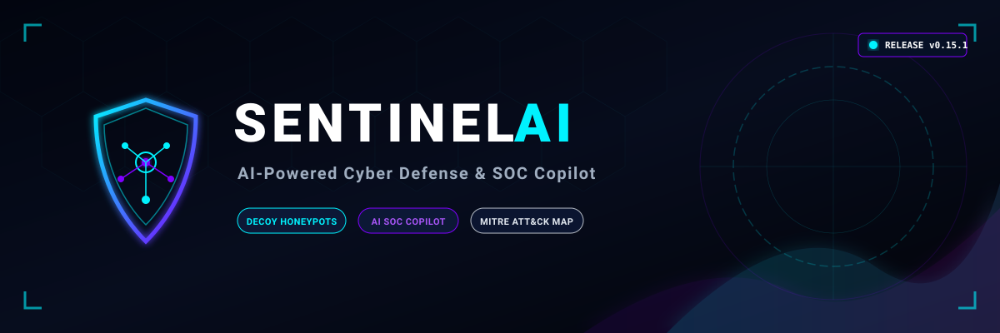
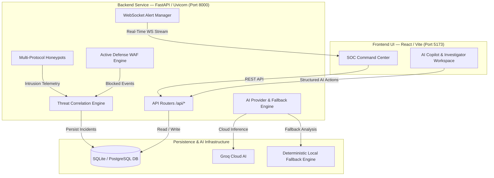
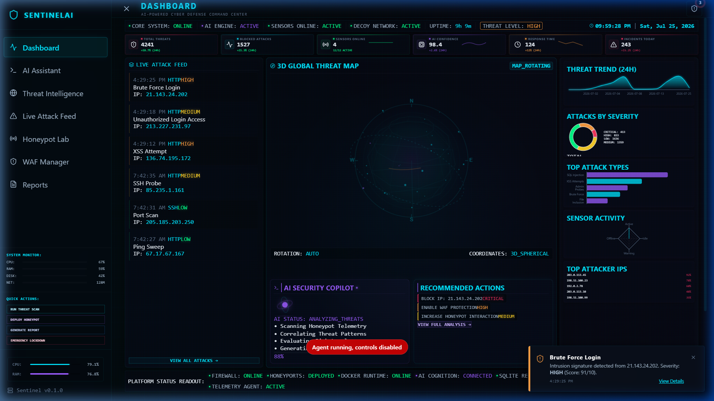
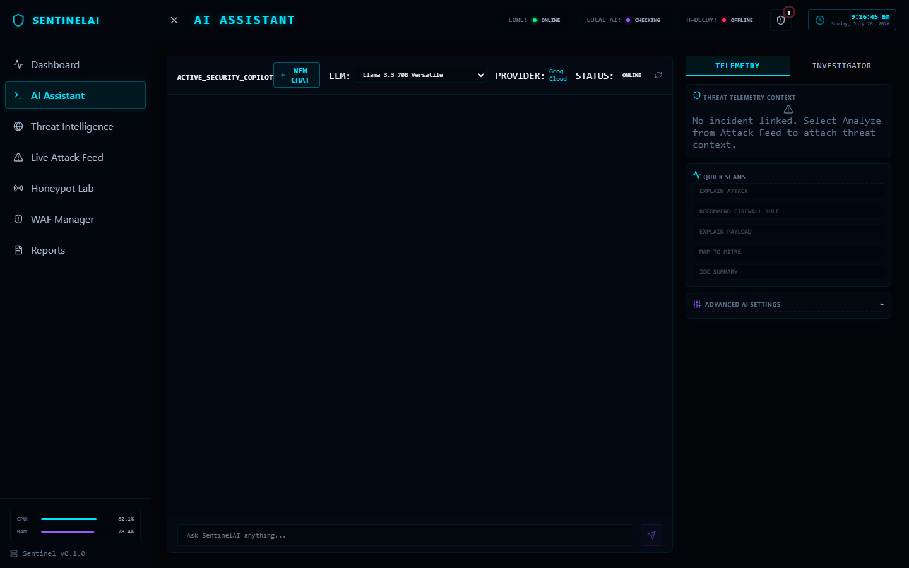
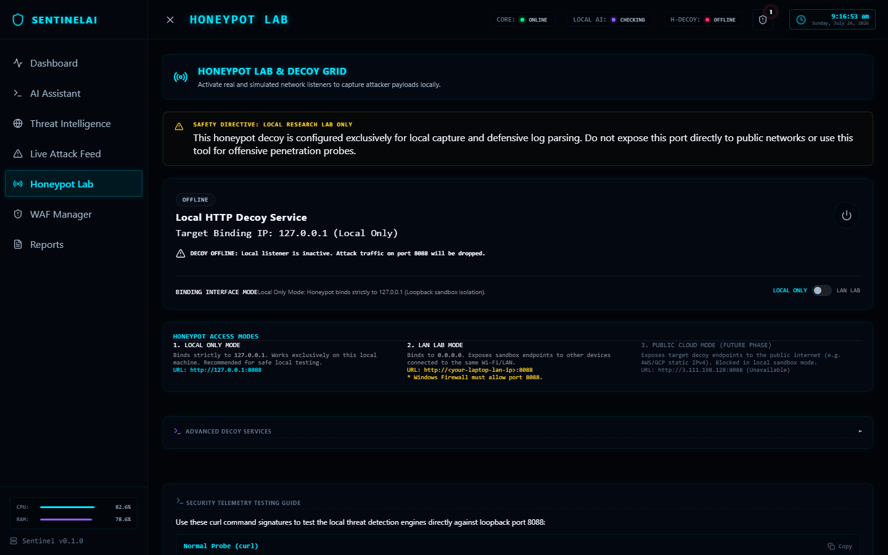
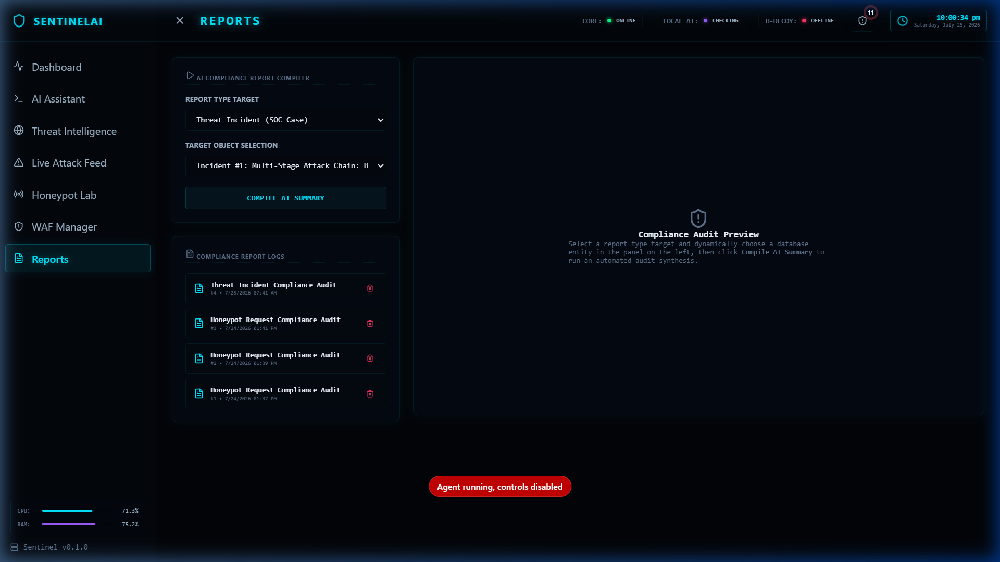

<p align="center">
  
</p>

<p align="center">
  
  
  
  
  
  
  
</p>

---

# SentinelAI — AI-Powered Cyber Defense Platform

SentinelAI is an advanced, local-first Security Operations Center (SOC) simulation, threat telemetry correlation, and AI-driven incident response platform. It integrates host vitals monitoring, active WAF defenses, multi-protocol decoy sensors (HTTP, SSH, FTP, Telnet), and automated MITRE ATT&CK mapping with an AI Security Copilot & Investigator Workspace. Groq Cloud is the primary live LLM provider. When Groq is unavailable or unconfigured, SentinelAI uses a deterministic local fallback response engine.

---

## 📌 Table of Contents

* [🚀 Key Features](#-key-features)
* [🛠️ Tech Stack](#️-tech-stack)
* [📐 System Architecture Summary](#-system-architecture-summary)
* [🖼️ Screenshots](#️-screenshots)
* [⚡ Quick Setup & Installation](#-quick-setup--installation)
* [🐳 Hybrid Deployment Support (Phase 16)](#-hybrid-deployment-support-phase-16)
* [📂 Project Structure](#-project-structure)
* [🔄 Usage Workflow](#-usage-workflow)
* [📅 Roadmap & Completed Milestones](#-roadmap--completed-milestones)
* [🛡️ Security & Legal Disclaimer](#️-security--legal-disclaimer)
* [📚 Documentation Index](#-documentation-index)
* [📄 License & Author](#-license--author)

---

## 🚀 Key Features

* **Real-time SOC Command Center**: Live dashboard with system vitals (CPU, RAM, Disk I/O via `psutil`), Threat Level indicators, AI Confidence rating (98.4%), and real-time WebSocket activity feeds.
* **Incident Response (`/attacks`)**: Real-time attack feed, filtering, payload inspection, and incident actions. Ingests normalized security events, offering instant filtering by severity (`CRITICAL`, `HIGH`, `MEDIUM`, `LOW`), protocol, and raw payload contents.
* **Threat Correlation Engine**: Groups related micro-events (SSH brute-force probes, SQLi scans) into aggregated **Correlated Incidents** with dynamic risk scoring and MITRE ATT&CK technique mapping.
* **AI Security Copilot & AI Investigator Workspace (Phase 15B)**:
  * **Telemetry Tab**: Interactive assistant with live model status and dynamic quick prompt buttons.
  * **Investigator Tab**: Incident & attack context selection panel featuring **7 Structured AI Investigation Actions**:
    1. *Analyze Incident*
    2. *Explain Severity*
    3. *Extract IOCs*
    4. *Recommend Containment*
    5. *Map to MITRE*
    6. *Generate Timeline*
    7. *Executive Summary*
* **Decoy Honeypot Lab**: Emulates vulnerable listening services (HTTP on `8088`, SSH on `2222`, FTP on `2121`, Telnet on `2323`) to capture exploit payloads safely.
* **Active Defense WAF**: Real-time SQL Injection, XSS, and Path Traversal inspection with an active IP quarantine blocklist.
* **Decoy Sandbox Environment**: Scans uploaded file artifacts against YARA rules and heuristic signatures.
* **Executive PDF & CSV Reports**: Generates downloadable executive compliance PDF reports and CSV incident logs.

---

## 🛠️ Tech Stack

### Backend
* **Runtime**: Python 3.11 or later. The backend container uses Python 3.11, and local development has been verified with Python 3.14.
* **Framework**: FastAPI (Uvicorn ASGI Server)
* **ORM & Persistence**: SQLAlchemy (SQLite for local dev, PostgreSQL for containerized setup)
* **Realtime Communication**: WebSockets (`/api/attacks/ws`)
* **AI Provider & Fallback**: Groq Cloud API (`llama-3.3-70b-versatile`) with a deterministic local fallback response engine when Groq is unconfigured or unavailable.
* **Testing**: Pytest automated test suite (19 test cases)

### Frontend
* **Runtime**: Node.js v18+
* **Framework**: React 18 with Vite
* **UI & Iconography**: Vanilla CSS custom design system, Lucide React icons
* **Data Visualization**: Recharts analytics graphs

### Deployment Foundation
* **Containerization**: Docker & Docker Compose
* **Reverse Proxy**: Nginx (HTTP/HTTPS proxying & WebSocket upgrading)
* **Databases**: SQLite (Development) / PostgreSQL (Containerized)
* **Backup Automation**: Shell scripts (`scripts/db_backup.sh`, `scripts/db_restore.sh`)

---

## 📐 System Architecture Summary


```mermaid
graph TB
    subgraph Client ["Frontend UI — React / Vite (Port 5173)"]
        UI["SOC Command Center"]
        AI_WS["AI Copilot & Investigator Workspace"]
    end

    subgraph Backend ["Backend Service — FastAPI / Uvicorn (Port 8000)"]
        API["API Routers /api/*"]
        WS_Manager["WebSocket Alert Manager"]
        Corr_Engine["Threat Correlation Engine"]
        WAF_Engine["Active Defense WAF Engine"]
        Decoy_Sensors["Multi-Protocol Honeypots"]
        AI_Adapter["AI Provider & Fallback Engine"]
    end

    subgraph Storage_AI ["Persistence & AI Infrastructure"]
        DB[("SQLite / PostgreSQL DB")]
        Groq_Cloud["Groq Cloud AI"]
        Local_Fallback["Deterministic Local Fallback Engine"]
    end

    UI -->|REST API| API
    AI_WS -->|Structured AI Actions| API
    WS_Manager -->|Real-Time WS Stream| UI
    Decoy_Sensors -->|Intrusion Telemetry| Corr_Engine
    WAF_Engine -->|Blocked Events| Corr_Engine
    Corr_Engine -->|Persist Incidents| DB
    API -->|Read / Write| DB
    AI_Adapter -->|Cloud Inference| Groq_Cloud
    AI_Adapter -->|Fallback Analysis| Local_Fallback
```

---

## 🖼️ Screenshots

### 🖥️ SOC Command Center Dashboard
Live threat logs, system vitals graph, active decoy sensor counters, and geographical threat map.


### 🤖 AI Security Copilot & Investigator Workspace
Dual-tab investigation workspace featuring Threat Context selection, model status, and 7 structured AI analysis actions.


### 🛡️ Honeypot & Decoy Lab
Logs and threat signatures captured from SSH, Telnet, HTTP, and FTP honey-pots.


### 🔬 Decoy Sandbox & Behavioral Analytics
Malicious file upload nodes, MD5 signature correlation, and dynamic simulation environments.


---

## ⚡ Quick Setup & Installation

### 1. Backend Setup
```powershell
# Navigate to backend directory
cd D:\Documents\SentinelAI\backend

# Create and activate virtual environment
python -m venv .venv
.\.venv\Scripts\activate

# Install dependencies
pip install -r requirements.txt

# Configure environment variables
cp .env.example .env

# Start FastAPI backend server
$env:PYTHONPATH="D:\Documents\SentinelAI"
.\.venv\Scripts\python.exe -m uvicorn main:app --port 8000
```
*Backend server runs at `http://127.0.0.1:8000`. SQLite tables are auto-seeded with demo data on startup.*

### 2. Frontend Setup
```powershell
# Open a new terminal in frontend directory
cd D:\Documents\SentinelAI\frontend

# Install dependencies
npm install

# Start Vite dev server
npm run dev -- --port 5173
```
*Open browser at:* **`http://localhost:5173`**

---

## 🐳 Hybrid Deployment Support (Phase 16)

SentinelAI includes containerized deployment foundation assets for hybrid lab setups:

```powershell
# Build and start Docker containers
docker-compose up -d --build
```
Orchestrates FastAPI backend, static Nginx reverse proxy, and PostgreSQL database.

* **Database Backup**: `./scripts/db_backup.sh`
* **Database Restore**: `./scripts/db_restore.sh ./backups/sentinelai_backup_*.sql`

---

## 📂 Project Structure

```text
SentinelAI/
├── backend/                  # FastAPI Application Layer
│   ├── api/                  # REST Routers (agent, attacks, sandbox, reports, waf, etc.)
│   ├── core/                 # Settings (config.py), security, logging
│   ├── database/             # SQLAlchemy session & seed script
│   ├── models/               # SQLAlchemy ORM model definitions
│   ├── schemas/              # Pydantic validation schemas
│   ├── services/             # Correlation engine, WAF defense, honeypots, AI adapters
│   └── tests/                # Pytest test suite (19 test cases)
├── frontend/                 # React Application Layer
│   ├── src/
│   │   ├── components/       # Reusable UI panels, charts, modals
│   │   ├── layouts/          # DashboardLayout sidebar shell
│   │   ├── pages/            # Views (Dashboard, AttackFeed, Agent, HoneypotLab, WAF, etc.)
│   │   └── routes/           # React Router router definition
├── docs/                     # Technical documentation & architecture guides
├── scripts/                  # Backup scripts and utility launchers
├── docker-compose.yml        # Docker Compose hybrid deployment orchestration
├── Dockerfile.backend        # Multi-stage Python backend image
├── Dockerfile.frontend       # Multi-stage Node/Nginx frontend image
└── nginx.conf                # Nginx reverse proxy configuration
```

---

## 🔄 Usage Workflow

```text
  Attacker Intrusion ➔ Decoy / WAF Sensor ➔ Threat Correlation Engine
         │
         ▼
  SOC Command Dashboard ➔ AI Investigator Workspace (/agent)
         │
         ▼
  7 Structured AI Actions ➔ Active Containment & Executive PDF Reports
```

1. **Intrusion Sensing**: Attacker executes path traversal or brute-force probe against decoy sensors.
2. **Correlation & Alerting**: Event is normalized, enriched with GeoIP, correlated, and broadcast via WebSockets.
3. **AI Triage**: Analyst opens `/agent`, selects threat context, and runs *Analyze Incident*, *Extract IOCs*, or *Recommend Containment*.
4. **Mitigation**: Analyst applies IP quarantine via WAF Manager and generates compliance reports.

---

## 📅 Roadmap & Completed Milestones

### Completed Milestones
* **Phases 1–13 (Core Platform)**: Logging pipeline, honeypots, correlation engine, sandbox, WAF, and WebSocket dashboard.
* **Phase 14 (Groq Integration & Viewport Stability)**: Groq Cloud API integration, secure `.env` key mapping, and single-shell viewport layout locking.
* **Phase 15A (AI Copilot Upgrade)**: Threat telemetry context injection, Quick Scans dispatcher, and tokenizing Markdown parser.
* **Phase 15B (AI Investigator Workspace)**: Dual-tab Telemetry & Investigator workspace, threat context selection panel, 7 structured AI investigation actions, and dual provider/fallback architecture.
* **Phase 16 (Deployment Foundation)**: Docker Compose orchestration, Nginx reverse proxy, PostgreSQL support, and DB backup/restore scripts.

### Future Scope (Postponed Work)
* **Phase 17**: Advanced SIEM Query Exporter (Splunk SPL, Elastic DSL, KQL).
* **Phase 18**: Multi-Agent Remote Telemetry Forwarders.
* **Phase 19**: Enterprise Role-Based Access Control (RBAC) & Audit Trails.
* **Postponed**: Hands-free Voice I/O Controls & Dynamic Honeypot IP Rotation.

---

## 🛡️ Security & Legal Disclaimer

SentinelAI is intended for defensive research, cybersecurity training, and authorized security operations testing. Decoy honeypot sensors should be executed inside isolated network segments. The authors are not responsible for unauthorized activities or improper external exposure.

---

## 📚 Documentation Index

For detailed architectural specifications and operational guides:
* [Project Overview](docs/PROJECT_OVERVIEW.md) — Mission guidelines and core modules.
* [System Architecture](docs/ARCHITECTURE.md) — Topology diagrams, schemas, and container layout.
* [Feature Reference](docs/FEATURES.md) — Comprehensive functional specifications for all 13 feature areas.
* [Installation & Setup](docs/SETUP.md) — Prerequisites, local commands, port maps, and Docker setup.
* [Operations Workflow](docs/WORKFLOW.md) — Step-by-step 8-stage threat lifecycle guide.
* [API Reference](docs/API_REFERENCE.md) — FastAPI endpoint JSON schemas and parameters.
* [Development Roadmap](docs/ROADMAP.md) — Progress mapping and future phases.
* [Security Notes](docs/SECURITY_NOTES.md) — Key security policies and sandbox boundaries.
* [AI Agent Specification](docs/10_AI_AGENT.md) — AI Copilot & AI Investigator Workspace specification.

---

## 📄 License & Author

* **Author**: [Vaishnav53](https://github.com/Vaishnav53)
* **Repository**: [SentinelAI on GitHub](https://github.com/Vaishnav53/SentinelAI)
* **License**: MIT License