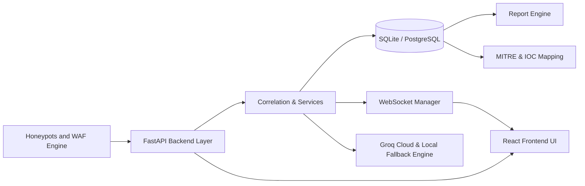

# 02 — System Architecture

> [!NOTE]
> **Design Specification**: This document is an initial system architecture design blueprint. For the comprehensive live system topology, schema models, and containerized hybrid deployment architecture, refer to [ARCHITECTURE.md](ARCHITECTURE.md).

---

## Logical Architecture Blueprint



## Runtime Services

1. FastAPI backend application (`main.py` on port `8000`)
2. React frontend application (`http://localhost:5173`)
3. Multi-protocol honeypot listeners (ports 8088, 2222, 2121, 2323)
4. Groq Cloud API & local fallback response engine
5. Containerized Nginx & PostgreSQL services (Phase 16 hybrid setup)

## Domain Boundaries

- **Attacks:** normalized security events and payload logs
- **Sensors:** honeypot traps and active WAF rules
- **Monitoring:** host CPU, RAM, and Disk metrics via `psutil`
- **AI:** status discovery, SSE chat, and 7 structured investigation actions
- **Reports:** asynchronous PDF reports and CSV log exports
- **MITRE:** ATT&CK tactics, techniques, and procedure mappings
- **Settings:** platform preferences and alert severity thresholds

## Event Flow

```text
Sensor / WAF event
  -> validation
  -> normalization & GeoIP enrichment
  -> threat correlation
  -> database persistence
  -> WebSocket broadcast
  -> UI update
  -> AI analysis & MITRE mapping
  -> PDF / CSV report export
```

## Reliability Principles

- All external API calls use strict timeouts.
- WebSockets reconnect automatically.
- Database startup and seeding is idempotent.
- Graceful error responses use standard FastAPI validators.
