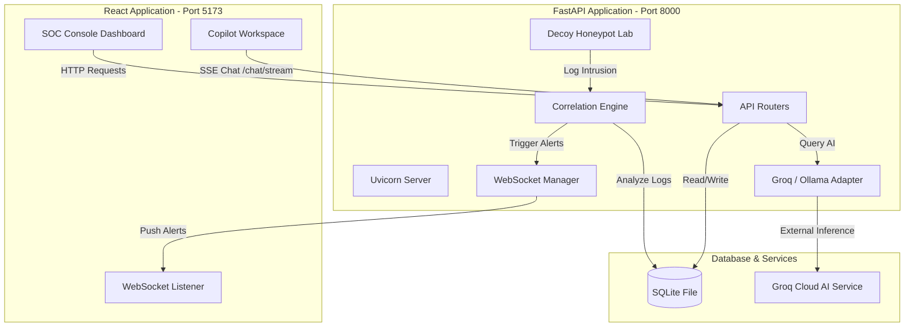

# System Architecture — SentinelAI

This document provides a technical walkthrough of SentinelAI’s design, detailing the communication pathways, data model relationships, and API routing schemas.

---

## 📐 System Topology

---

## 🗄️ Database Schema & Models

SentinelAI uses SQLAlchemy to manage five primary relational tables stored in a local SQLite file (`sentinel.db`).

### 1. `AttackEvent`
Stores raw logs captured by host metrics sensors or decoy honeypots.
* `id` (Integer, Primary Key)
* `external_id` (String, unique identifier e.g. HON-1294812)
* `source_ip` (String) | `source_port` (Integer)
* `destination_port` (Integer)
* `protocol` (String - TCP/UDP)
* `attack_type` (String - Port Scan, Path Traversal, Brute Force)
* `severity` (String - Low, Medium, High, Critical)
* `threat_score` (Integer, 0-100)
* `confidence` (Float, 0.0-1.0)
* `payload` (Text - captured command buffers/headers)
* `city` / `country` (String - GeoIP lookup)
* `created_at` (DateTime)

### 2. `CorrelatedIncident`
Groups multiple similar `AttackEvent` logs based on matching attributes (e.g. same source IP, target port range, timeline clusters).
* `id` (Integer, Primary Key)
* `incident_type` (String)
* `severity` (String)
* `status` (String - Active, Under Investigation, Mitigated)
* `attack_count` (Integer)
* `source_ip` (String)
* `threat_score` (Integer)
* `summary` (Text)
* `created_at` / `updated_at` (DateTime)

### 3. `PlaybookWorkflow`
Tracks active mitigation playbook setups and execution history.
* `id` (Integer, Primary Key)
* `name` (String)
* `description` (Text)
* `status` (String - Active, Inactive)
* `actions` (JSON array of steps)
* `created_at` (DateTime)

### 4. `SandboxTelemetry`
Tracks payload behaviors executed within the local behavioral decoy containment unit.
* `id` (Integer, Primary Key)
* `file_name` (String)
* `md5_hash` (String)
* `signature_matches` (JSON array)
* `execution_logs` (Text)
* `created_at` (DateTime)

---

## 🔌 API Endpoints Structure

All backend HTTP endpoints are prefixed with `/api` and organized into logical routers:

### 1. Agent Assistant (`/api/agent`)
* `GET /status`: Returns AI status (ONLINE/OFFLINE), latency, provider, and dynamically loaded models list.
* `POST /chat`: Simple non-streaming assistant prompt.
* `POST /chat/stream`: Server-Sent Events (SSE) streaming chat completions utilizing the context payload.
* `POST /analyze/{attack_id}`: Runs an immediate automated Groq analysis on a raw attack log.
* `GET /conversations`: Lists historical threat analysis threads.
* `DELETE /conversations/{id}`: Deletes a chat history thread.

### 2. Attacks Feed (`/api/attacks`)
* `GET /`: Lists all captured `AttackEvent` entries.
* `GET /{id}`: Gets full detail for a single attack.
* `POST /simulate`: Triggers a dummy attack to test alerting.

### 3. Incidents Router (`/api/incidents`)
* `GET /`: Lists aggregated correlated incidents.
* `POST /{id}/mitigate`: Changes status to mitigated and executes response steps.

### 4. Decoy Sandbox (`/api/sandbox`)
* `POST /upload`: Ingests a mock payload file for analysis.
* `GET /logs`: Lists historical sandbox telemetry runs.
