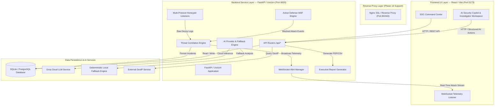

# System Architecture — SentinelAI

This document provides a technical walkthrough of SentinelAI’s architecture, detailing the multi-tier system topology, data model schemas, AI provider adapters, sub-system components, and containerized hybrid deployment foundation.

---

## 📐 System Topology

```mermaid
graph TB
    subgraph Client ["Frontend UI Layer — React / Vite (Port 5173)"]
        UI["SOC Command Center"]
        AI_WS["AI Security Copilot & Investigator Workspace"]
        WS_Client["WebSocket Telemetry Listener"]
    end

    subgraph Reverse_Proxy ["Reverse Proxy Layer (Phase 16 Support)"]
        Nginx["Nginx SSL / Reverse Proxy (Port 80/443)"]
    end

    subgraph Backend ["Backend Service Layer — FastAPI / Uvicorn (Port 8000)"]
        Uvicorn["FastAPI / Uvicorn Application"]
        Router["API Routers /api/*"]
        WS_Manager["WebSocket Alert Manager"]
        Corr_Engine["Threat Correlation Engine"]
        WAF_Engine["Active Defense WAF Engine"]
        Decoy_Sensors["Multi-Protocol Honeypot Listeners"]
        AI_Adapter["AI Provider & Fallback Engine"]
        Report_Engine["Executive Report Generator"]
    end

    subgraph Persistence ["Data Persistence & AI Services"]
        DB[("SQLite / PostgreSQL Database")]
        Groq_Cloud["Groq Cloud LLM Service"]
        Local_Fallback["Deterministic Local Fallback Engine"]
        GeoIP_API["External GeoIP Service"]
    end

    UI -->|HTTP / REST API| Router
    AI_WS -->|HTTP / Structured AI Actions| Router
    WS_Manager -->|Real-Time Attack Stream| WS_Client
    Decoy_Sensors -->|Raw Decoy Logs| Corr_Engine
    WAF_Engine -->|Blocked Attack Events| Corr_Engine
    Corr_Engine -->|Persist Incidents| DB
    Corr_Engine -->|Broadcast Telemetry| WS_Manager
    Router -->|Read / Write| DB
    AI_Adapter -->|Cloud Inference| Groq_Cloud
    AI_Adapter -->|Fallback Analysis| Local_Fallback
    Router -->|Query GeoIP| GeoIP_API
    Router -->|Generate PDF/CSV| Report_Engine
```

---

## 🏗️ Multi-Tier Layer Architecture

### 1. Frontend Layer (React + Vite)
* Built using React 18 and Vite for lightning-fast HMR and build performance.
* Styled with Vanilla CSS custom design tokens, modern dark mode aesthetics, and glassmorphism UI components.
* Communicates with backend endpoints via Axios (`/api/*`) and real-time WebSockets (`/api/attacks/ws`).

### 2. Backend Service Layer (FastAPI)
* Async FastAPI application running on Uvicorn (Port `8000`).
* Modular API router structure (`api/attacks.py`, `api/agent.py`, `api/honeypot.py`, `api/correlation.py`, `api/waf.py`, `api/sandbox.py`, `api/reports.py`, `api/settings.py`).
* Real-time WebSocket connection manager broadcasting normalized threat events to all connected SOC client dashboards.

### 3. Data Persistence Layer (SQLAlchemy & Database)
* Supports local SQLite file storage (`sentinelai.db`) for rapid local development and testing.
* Compatible with PostgreSQL via SQLAlchemy ORM abstractions for containerized hybrid deployment setups.
* Database initialization and seed script automatically populates initial demo telemetry (`populate_demo_data()`).

### 4. AI Layer (Groq Cloud & Local Fallback Engine)
* **Groq Cloud API**: Groq Cloud is the primary live LLM provider (`llama-3.3-70b-versatile`) for high-speed cloud inference.
* **Deterministic Local Fallback Engine**: When Groq is unavailable or unconfigured, SentinelAI uses a deterministic local fallback response engine to supply structured incident analyses without breaking the interface.

### 5. Threat Intelligence & GeoIP Layer
* Enriches incoming external IP addresses with geographical data (country, city) and IP threat scores.

### 6. Threat Correlation Engine
* Clusters individual `AttackEvent` logs matching common source IPs, target protocol vectors, or time windows into unified `CorrelatedIncident` entities with dynamic composite severity ratings.

### 7. Active Defense WAF Engine
* Inspects incoming HTTP request parameters for SQL Injection (SQLi), Cross-Site Scripting (XSS), and path traversal signatures.
* Dynamically manages an active IP quarantine blocklist.

### 8. Multi-Protocol Honeypot Lab
* Runs isolated Python socket listeners emulating common protocol services:
  * **HTTP Decoy Sensor**: Port `8088` (Captures web exploits, path traversal)
  * **SSH Decoy Sensor**: Port `2222` (Captures brute-force login attempts)
  * **FTP Decoy Sensor**: Port `2121` (Captures file upload/recon probes)
  * **Telnet Decoy Sensor**: Port `2323` (Captures IoT botnet probes)

### 9. Reporting Subsystem
* Generates downloadable executive compliance PDF reports using ReportLab and raw incident data CSV exports.

---

## 🗄️ Database Schema & Models

### 1. `AttackEvent`
Stores raw logs captured by host sensors, WAF filters, or honeypot sensors.
* `id` (Integer, Primary Key)
* `external_id` (String, Unique)
* `source_ip` (String) | `source_port` (Integer)
* `destination_port` (Integer)
* `protocol` (String - TCP/UDP)
* `attack_type` (String - Port Scan, Path Traversal, Brute Force, SQLi, XSS)
* `severity` (String - LOW, MEDIUM, HIGH, CRITICAL)
* `threat_score` (Integer, 0-100)
* `confidence` (Float, 0.0-1.0)
* `payload` (Text - Command buffers/request headers)
* `city` / `country` (String - GeoIP lookup)
* `created_at` (DateTime)

### 2. `CorrelatedIncident`
Groups related `AttackEvent` entries into aggregated incidents.
* `id` (Integer, Primary Key)
* `incident_type` (String)
* `severity` (String)
* `status` (String - Active, Under Investigation, Mitigated)
* `attack_count` (Integer)
* `source_ip` (String)
* `threat_score` (Integer)
* `summary` (Text)
* `created_at` / `updated_at` (DateTime)

### 3. `PlaybookWorkflow`
Tracks active mitigation playbook setups and execution steps.
* `id` (Integer, Primary Key)
* `name` (String) | `description` (Text)
* `status` (String - Active, Inactive)
* `actions` (JSON array of steps)
* `created_at` (DateTime)

### 4. `SandboxTelemetry`
Tracks mock payload behaviors scanned by the decoy sandbox engine.
* `id` (Integer, Primary Key)
* `file_name` (String) | `md5_hash` (String)
* `signature_matches` (JSON array)
* `execution_logs` (Text)
* `created_at` (DateTime)

---

## 🐳 Hybrid Deployment Support (Phase 16)

SentinelAI provides containerized deployment foundation assets for hybrid and enterprise lab setups:
* `Dockerfile.backend`: Multi-stage Python container setup for FastAPI.
* `Dockerfile.frontend`: Multi-stage Node/Nginx container setup for building static frontend distribution.
* `docker-compose.yml`: Orchestrates FastAPI backend, Nginx reverse proxy, and PostgreSQL database.
* `nginx.conf`: Configures HTTP/HTTPS reverse proxy, API routing, and WebSocket upgrading (`/api/attacks/ws`).
* `scripts/db_backup.sh` & `scripts/db_restore.sh`: Automated database backup and recovery scripts.
