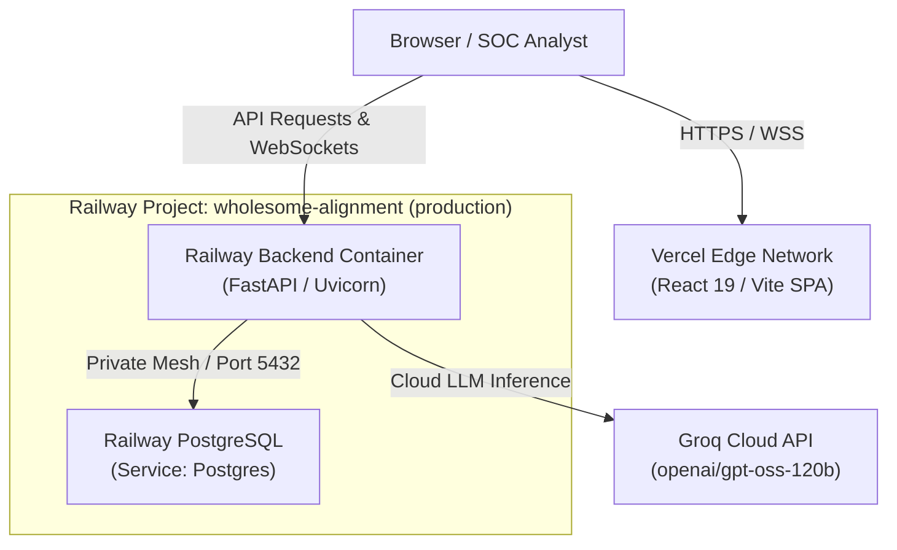

# Deployment Architecture & Production Guide — SentinelAI

This guide details the decoupled production deployment architecture for SentinelAI across **Vercel** (Frontend), **Railway** (Backend API), and **Railway PostgreSQL** (Database).

---

## 🏗️ Architecture Overview



SentinelAI employs a decoupled hosting model:
1. **Frontend on Vercel**: Serves the Single Page Application globally with low-latency edge caching and instant invalidation.
2. **Backend on Railway**: Executes a persistent container from `Dockerfile.backend`, sustaining persistent WebSockets (`/api/attacks/ws`), unbuffered Server-Sent Events (SSE), and background threat simulators.
3. **Database on Railway PostgreSQL**: Operates on Railway's private WireGuard network mesh, completely isolated from public TCP access.

---

## ⚙️ Service 1: Railway Backend Service

### Source & Build Settings
* **Repository**: `Vaishnav53/SentinelAI`
* **Branch**: `main`
* **Build Type**: Dockerfile
* **Dockerfile Path**: `Dockerfile.backend` (must be specified in Railway under **Settings → Build → Dockerfile Path** or via `RAILWAY_DOCKERFILE_PATH=Dockerfile.backend`).
* **Start Command**: Leave blank/empty (Railway uses the container's `CMD ["sh", "-c", "uvicorn backend.main:app --host 0.0.0.0 --port ${PORT:-8000}"]`).

### Deploy & Healthcheck Settings
* **Healthcheck Path**: `/ready`
* **Healthcheck Timeout**: `300` seconds
* **Replicas**: Strictly `1` (ensures single-node in-memory WebSocket connection management and prevents duplicate simulator loops).

### Networking
* Under **Settings → Networking → Public Networking**, click **Generate Domain** to assign a public `.up.railway.app` hostname with automatic SSL.

### Environment Variables
| Variable | Value / Format | Purpose |
| :--- | :--- | :--- |
| `APP_ENV` | `production` | Enforces production security guards on startup |
| `DATABASE_URL` | `${{ Postgres.DATABASE_URL }}` | Private reference variable to the provisioned PostgreSQL service |
| `FRONTEND_ORIGIN` | `https://<your-vercel-app>.vercel.app` | CORS allowlist for credentials |
| `TRUSTED_HOSTS` | `healthcheck.railway.app,*.up.railway.app,*.railway.internal,localhost,127.0.0.1` | Allows Railway's healthcheck domain and public domains past `TrustedHostMiddleware` |
| `SECRET_KEY` | *(Random 32+ byte hex string)* | Session signing key (required in production) |
| `AUTH_COOKIE_SECURE` | `true` | Enforces `Secure` flag on session cookies |
| `AUTH_COOKIE_SAMESITE` | `none` | Enables cross-origin cookie delivery between Vercel and Railway |
| `SENTINEL_ADMIN_USERNAME` | `dyn4m1t3` | Bootstrap administrator account |
| `SENTINEL_ADMIN_PASSWORD` | *(Secure custom password)* | Password used by `AuthService.bootstrap_admin_user` on initial startup |
| `SENTINEL_ADMIN_EMAIL` | `admin@sentinel.ai` | Administrator email |
| `GROQ_API_KEY` | `gsk_...` | Groq Cloud API key for streaming AI Copilot |
| `DEFAULT_GROQ_MODEL` | `openai/gpt-oss-120b` | Default Groq model identifier |
| `LOG_LEVEL` | `INFO` | Structured logging verbosity |

---

## 🗄️ Service 2: Railway PostgreSQL

* **Service Name**: `Postgres`
* **Security Rule**: **Do not enable a public PostgreSQL TCP proxy**. 
* **Connection**: The backend connects directly over Railway's private WireGuard network using `${{ Postgres.DATABASE_URL }}`.
* **Schema Initialization**: Database tables, index creation, missing column schema adjustments, and initial demo seed data are executed idempotently on container startup via FastAPI's `lifespan` handler.

---

## 🌐 Service 3: Vercel Frontend

### Build & Output Settings
* **Framework Preset**: Vite
* **Root Directory**: `frontend` (or project root with `frontend/dist`)
* **Build Command**: `npm run build`
* **Output Directory**: `dist`
* **Install Command**: `npm install`

### SPA Routing (`vercel.json`)
```json
{
  "rewrites": [
    { "source": "/(.*)", "destination": "/index.html" }
  ]
}
```

### Environment Variables
| Variable | Value | Description |
| :--- | :--- | :--- |
| `VITE_API_BASE_URL` | `https://<your-railway-backend>.up.railway.app/api` | Absolute HTTPS API endpoint |
| `VITE_WS_BASE_URL` | `wss://<your-railway-backend>.up.railway.app` | Absolute WSS endpoint for real-time threat feed |

---

## 🔒 Cross-Origin Cookie Security Notice

Because the frontend is hosted on `*.vercel.app` and the backend is hosted on `*.up.railway.app`, requests carrying authentication cookies are classified as **cross-site**. 

To allow the browser to transmit session cookies with credentials:
1. `AUTH_COOKIE_SAMESITE` must be set to `none`.
2. `AUTH_COOKIE_SECURE` must be set to `true` (enforced by modern browsers when `SameSite=None`).
3. Both conditions are strictly checked by SentinelAI's production startup guard in `backend/main.py`.
